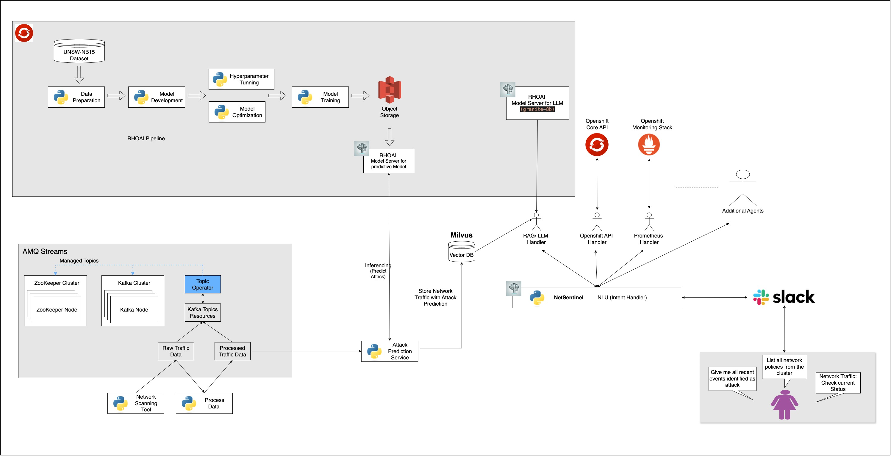

### NetSentinel

NetSentinel is an AI-powered chatbot platform integrated with Slack, showcasing the potential of predictive analysis, generative AI and Natural Language Understanding (NLU) for advanced use cases. Designed as a versatile proof of concept, it demonstrates attack detection and response using mock data. While initially focused on network intrusion detection, and communication with OCP API and Prometheus API, its flexible architecture supports use cases across industries, from customer support to billing inquiries.

NetSentinel's future vision includes integrating human agents into workflows, allowing users to escalate queries that the AI cannot answer. Agents could range from document processors to knowledge base managers or balance inquiry handlers, showcasing the system's adaptability to various operational needs.



### Key Components and Features:

- **Generative and Predictive AI:** The system leverages `granite-8b-code-instruct-128k` for generative capabilities, a predictive model trained on the `UNSW-NB15` dataset for anomaly detection, and an NLU component to interpret human intent as the entry point for all interactions.

- **Slack Chatbot Integration:** Users can interact with the chatbot through Slack, asking queries like "List all network events identified as attacks" or "Check network traffic metrics" and receiving instant, AI-driven or API-driven responses.

- **Future-Ready Human-in-the-Loop Design:** Though not currently implemented, the architecture envisions seamless escalation to human agents for cases requiring specialized intervention.

- **Multi-Agent Architecture:**
  - **NLU Agent:** Processes natural language queries to extract user intent and actionable data.
  - **Predictive and Generative Agents:** Detect anomalies and respond to network or general queries.
  - **OpenShift API Agent:** Executes operational commands like listing network policies or checking pod compliance in an OpenShift environment.
  - **Prometheus Agent:** Enables observability, running PromQL queries to monitor metrics.

### Use Case Versatility:

NetSentinel's design extends beyond telecom. The framework can be adapted to create:

- Customer support chatbots
- Billing inquiry handlers
- Document processing agents
- Knowledge base assistants
- And more, with minimal customization.

### Demo Highlights:

- Showcases AI-driven attack detection using simulated data
- Demonstrates interactive Slack-based querying for various scenarios
- Highlights adaptability for industry-specific use cases, such as customer service or network operations
- Leverages various OpenShift components to demonstrate Red Hat OpenShift AI functionality:
  - **Kafka** as a middleware service for event streaming
  - **NVIDIA Triton** model server to deploy the predictive model
  - Hosted **Model-as-a-Service** integration to interact with `granite-8b-code-instruct-128k`
  - **OpenShift Tekton Pipeline** to automate the image-building process
  - **RHOAI Kubeflow Pipeline** to showcase the predictive model training process

NetSentinel offers a glimpse into the future of AI-enhanced operational workflows, emphasizing adaptability, scalability, and real-time response for diverse applications.

## Order OpenShift Environment

- Any OpenShift environment should work technically, provided there are no operator conflicts. To avoid issues, it’s recommended to start with a clean environment since the project requires installing multiple operators and configurations.
- For testing purposes, we are using the following environment.
  - Order an OCP demo cluster via this [URL](https://catalog.demo.redhat.com/catalog?item=babylon-catalog-prod/sandboxes-gpte.ocp-wksp.prod&utm_source=webapp&utm_medium=share-link)
  - Select **OpenShift Version 4.17** during setup.
  - Only a single control plane is sufficient.
  - If you are using **Model as a Service** for the LLM model, a CPU-only setup is adequate for deploying this project.

## Clone NetSentinel locally

```
git clone ssh://git@gitlab.consulting.redhat.com:2222/ai-odyssey-2025/netsentinel/netsentinel.git
cd netsentinel
```

## Deploy NetSentinel on OpenShift

### 1. Create new openshift projects

Apply the pre-defined namespace configurations using Kustomize:

```
oc apply -k k8s/namespaces/base
```

Ensure the namespace in the Kustomize configuration matches your desired namespace (e.g., `netsentinel`). Update it in all relevant locations if needed.

### 2. Deploy Operators

We are using the following operators for this project. If they are already installed, ensure there are no conflicts with the new installation:

- amq-streams-operator
- milvus
- minio
- openshift-ai
- openshift-cert-manager-operator
- openshift-servicemesh
- prometheus-operator
- serverless-operator

You can use the following command to install them:

```
oc apply -k k8s/operators/overlays/common
```

> Note: Currently, we are using the `amq-streams-2.7.x` version. Older versions of Kafka exhibited different behavior, so it is important to use this version for consistency.

> Note: The demo environment we are using above already contains cert manager operator. If you are using different demo environment you may have to install this operator separtely. Check following files to include this operator as well, `k8s/operators/overlays/common/kustomization.yaml` and `k8s/instances/overlays/common/kustomization.yaml`

> Note: Ensure all operators are active and running before proceeding. Navigate to Operators > Installed Operators in the OpenShift Console to verify their status.

> Note: Verify that the Red Hat OpenShift AI Operator is properly configured and that all components are active and functioning correctly. You can check their status on the Operator page under "All Instances" in the OpenShift Console.

### 3. Deploy Instances of Operators

#### Deploy common Operators

```
oc apply -k k8s/instances/overlays/common
```

#### Deploy kafka instance

To deploy the Kafka instance, follow these steps:

- Update Cluster DNS

Replace `<CLUSTER_NAME_WITH_BASE_DOMAIN>` with your cluster's DNS name.

Example you can run following command, replace `cluster-bbgs4.bbgs4.sandbox592.opentlc.com` with your cluster DNS.

```
find ./k8s/instances/overlays/rhlab/kafka/ -type f -exec sed -i '' 's/<CLUSTER_NAME_WITH_BASE_DOMAIN>/cluster-bbgs4.bbgs4.sandbox592.opentlc.com/g' {} +
```

Ensure the following files have been modified as expected:

```
git status
```

Output:

```
On branch cleanup
Changes not staged for commit:
  (use "git add <file>..." to update what will be committed)
  (use "git restore <file>..." to discard changes in working directory)
	modified:   k8s/instances/overlays/rhlab/kafka/patches/console-kafka.kafka.yaml
	modified:   k8s/instances/overlays/rhlab/kafka/patches/console-ui.route.yaml
	modified:   k8s/instances/overlays/rhlab/kafka/patches/console.deployment.yaml

```

To further validate the changes, you can run the following command:

```
git diff .
```

> Ensure the DNS is:
> Publicly resolvable.
> Domain is Not using a self-signed certificate. Certificates must be valid.
> Note: This is required for communication with Slack channels.
> If deploying in an OpenShift cluster where the DNS is not publicly resolvable and uses self-signed certificates, you can use tools like ngrok as a workaround.

- Apply Kafka Configuration

Deploy the Kafka instance using the following command:

```
oc apply -k k8s/instances/overlays/rhlab/
```

- Wait for Kafka to Start

It may take some time for Kafka to be fully operational. The `CreateContainerConfigError` status for certain pods (e.g., Kafka console) will resolve automatically once kafkausers are created and the necessary secrets are available.

Check the pods status

```
oc get pods -n netsentinel
```

Example output during initialization:

```
NAME                        READY   STATUS                       RESTARTS   AGE
console-5c498fb9c4-ffm6v    1/2     CreateContainerConfigError   0          67s
console-kafka-kafka-0       1/1     Running                      0          22s
console-kafka-kafka-1       0/1     Running                      0          22s
console-kafka-kafka-2       0/1     Running                      0          22s
console-kafka-zookeeper-0   1/1     Running                      0          57s
console-kafka-zookeeper-1   1/1     Running                      0          57s
console-kafka-zookeeper-2   1/1     Running                      0          57s
```

- Verify Kafka Users

```
oc get kafkausers -n netsentinel
```

Output:

```
NAME                     CLUSTER         AUTHENTICATION   AUTHORIZATION   READY
console-kafka-user1      console-kafka   scram-sha-512    simple          True
netsentinel-kafka-user   console-kafka   scram-sha-512    simple          True
```

- Confirm All Pods are Running

After a few minutes, verify that all pods are running as expected:

```
oc get pods -n netsentinel
```

Output:

```
NAME                                             READY   STATUS    RESTARTS   AGE
console-5c498fb9c4-ffm6v                         2/2     Running   0          2m39s
console-kafka-entity-operator-74f8599b68-mmrq6   2/2     Running   0          81s
console-kafka-kafka-0                            1/1     Running   0          114s
console-kafka-kafka-1                            1/1     Running   0          114s
console-kafka-kafka-2                            1/1     Running   0          114s
console-kafka-zookeeper-0                        1/1     Running   0          2m29s
console-kafka-zookeeper-1                        1/1     Running   0          2m29s
console-kafka-zookeeper-2                        1/1     Running   0          2m29s
```

Your Kafka instance is now ready to use. You can browse kafka console using following url.

```
URL=$(oc get routes console-ui-route -o jsonpath='{.spec.host}' -n netsentinel)
echo "https://$URL"
open "https://$URL"
```

### 4. Deploy Predictive Model

Follow guide [Deploy Predictive Model](./docs/deploy-predictive-model.md)

### 5. Create a New API Token for "Models as a Service" on OpenShift AI

Follow guide [Model as a service](./docs/model-as-a-service.md)

### 6. Deploy NetSentinel Application

- Ensure that you are using `netsentinel` when you deploy the model so that it will match following config otherwise update this config in this file `k8s/apps/overlays/rhlab/netsentinel/app-config.yaml`

```
models:
  predictive:
    url: "http://modelmesh-serving.netsentinel:8008/v2/models/netsentinel/infer"
    token: ""
    verify_ssl: true
```

- Ensure that `<YOUR_API_KEY_HERE>` is replaced with the actual API key in the `models.llm.token` section of the file `k8s/apps/overlays/rhlab/netsentinel/app-config.yaml` as part of Step 5. The URL and model name should remain consistent across all MaaS-deployed services. If they differ, adjust those values accordingly to maintain consistency.

Now Deploy NetSentinel application

```
oc apply -k k8s/apps/overlays/rhlab/
```

The `netsentinel-xxxxxx-xxxx` application may continuously reboot due to the absence of a valid Slack token. However, the other services `create-mock-data`, `prediction-service`, and p`rocess-mock-data` should remain operational. If this is the only issue currently observed, you can proceed to the next section.

```
oc get pods -n netsentinel
```

Output:

```
NAME                                                    READY   STATUS             RESTARTS      AGE
console-6f98ccfd7b-p4st9                                2/2     Running            0             28m
console-kafka-entity-operator-74f8599b68-jp5ld          2/2     Running            0             26m
console-kafka-kafka-0                                   1/1     Running            0             27m
console-kafka-kafka-1                                   1/1     Running            0             27m
console-kafka-kafka-2                                   1/1     Running            0             27m
console-kafka-zookeeper-0                               1/1     Running            0             28m
console-kafka-zookeeper-1                               1/1     Running            0             28m
console-kafka-zookeeper-2                               1/1     Running            0             28m
create-mock-data-849c468b85-2njfd                       1/1     Running            0             8m43s
minio-79f8869bf5-wmp6z                                  1/1     Running            0             29m
modelmesh-serving-netsentinel-triton-86c48cfd45-jw5h4   5/5     Running            0             16m
netsentinel-85c56c767b-mstsk                            0/1     CrashLoopBackOff   3 (47s ago)   8m43s
prediction-service-6b5558dc66-rj7d4                     1/1     Running            0             8m43s
process-mock-data-78bb5fbff8-2jh69                      1/1     Running            0             8m43s
```

### 7. Configure SLACK for communication with the bot

Follow doc [Slack Configuration](./docs/configure-slack.md)

### 8. Test cases using Slack

You can now execute the following queries to test the features and capabilities of the agents. Currently, the NLU model is trained on a limited dataset of approximately 400 records, so the model's responses may not be highly accurate. You can review the dataset in `rasa/nlu.yml`.

For now, you can use the queries below to test the functionality. As we expand the dataset and build more stories, the model's performance will improve without requiring significant changes to the codebase.

#### Trigger NLU Agent

- Hello
- Who are you?
- What else you can do?

#### Trigger Predictive Model

- Get me recent event identified as attack
- Get me 5 recent event identified as normal traffic

- Tell more more about this event id: f656df24-a94c-4325-a91e-074c871a012c
- Any other events from source ip: 10.0.0.249
- Any other events going to destination ip 172.16.0.197

#### Trigger Openshift API Agent

- list all pods from namespace: netsentinel
- list all network policy from namespace: netsentinel
- Create network policy in namespace: default to block traffic from source ip 192.168.1.91

#### Trigger Promethues Agents

- what is the network traffic usage looks like

#### General answer from LLM model

- What is Openshift AI?
- What is TCP IP?

#### Other sample agents

- Which pods are non-compliant with security policies?

> The following query consistently returns the same response; it is intended solely to demonstrate ability to invoke different functions. This approach can be extended to implement features like Clair integration, logging solutions, or similar functionalities.

- Audit logs: get security logs for the past day
- Scan the cluster for vulnerabilities

## Cleanup

Execute the commands in the specified sequence to ensure proper deletion, as Kafka topics may not be deleted if the order is not followed:

```
oc delete -k k8s/apps/overlays/rhlab/netsentinel/
oc delete -k k8s/instances/overlays/common
oc delete kafkatopics --all -n netsentinel
oc delete -k k8s/instances/overlays/rhlab
oc delete -k k8s/apps/base/models

oc delete pvc --all -n netsentinel

oc delete deployment --all -n milvus-operator
oc delete sts --all -n milvus-operator
oc delete pvc --all -n milvus-operator
oc delete -k k8s/namespaces/base
```
