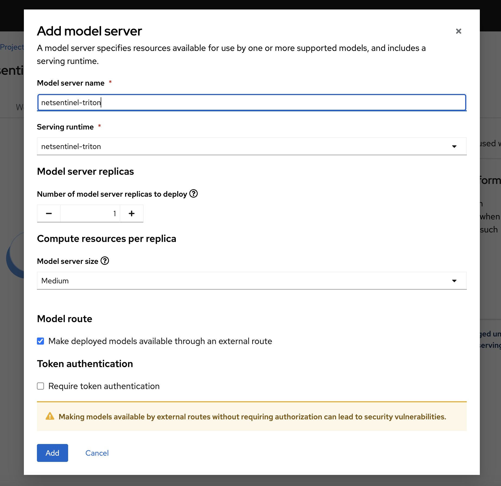

# Setting Up MinIO and Models for NetSentinel

- Ensure your MinIO service is up and running.

```
oc get pods -l  app=minio -n netsentinel
NAME                     READY   STATUS    RESTARTS   AGE
minio-79f8869bf5-tntxq   1/1     Running   0          3h14m
```

Any S3-compatible bucket will work, but we assume the default credentials are `minio` (username) and `minio123` (password) with the following S3 endpoint. Update these settings in the appropriate locations if needed.

Get the minio endpoints as follows.

```
S3_ENDPOINTS=$(oc get routes minio-api -o jsonpath='{.spec.host}' -n netsentinel)
echo $S3_ENDPOINTS
```

## Install AWS CLI

```
pip install awscli
```

## Configure AWS CLI

```
aws configure
AWS Access Key ID [None]: minio
AWS Secret Access Key [None]: minio123
Default region name [None]: us-east-1
Default output format [None]:
```

## Create Alias and S3 Bucket

Minio endpoints from above.

```

alias s3="aws s3 --endpoint-url https://$S3_ENDPOINTS"
s3 mb s3://netsentinel
```

Validate:

```
s3 ls
```

Output:

```
2024-12-04 18:20:38 netsentinel
```

---

## Download and Upload Predictive Model

Download the predictive model from Hugging Face and upload it to MinIO:

```
git clone https://huggingface.co/bkpandey/netsentinel predictive-model
cd predictive-model/
s3 cp v1/config.pbtxt s3://netsentinel/predictive-model/config.pbtxt
s3 cp v1/1/model.onnx s3://netsentinel/predictive-model/1/model.onnx
```

Validate:

```
s3 ls s3://netsentinel --recursive
```

Output:

```
2024-12-04 18:23:24  300449102 predictive-model/1/model.onnx
2024-12-04 18:21:33        276 predictive-model/config.pbtxt
```

Go back to root folder

```
cd ..
```

## Deploy Model Using Triton Serving Runtime

### Step 1: Create Serving Runtime

1. Navigate to the **Red Hat OpenShift AI (RHOAI)** dashboard from the OpenShift Console Menu.
2. Go to **Settings > Serving Runtimes**.
3. Click on **Add Serving Runtime**.
4. Select **Multi-model serving platform** from the dropdown menu.
5. Choose **Start from Scratch**.
6. Copy the content from the file:  
   `k8s/apps/base/models/predictive-triton/002-triton-serving-runtime.yaml`
   and paste it into the provided text box.
7. Click **Create**.

---

### Step 2: Create Model Server

1. In the RHOAI dashboard, navigate to **Data Science Projects**.
2. Select **netsentinel** from the project list.
3. On the project dashboard, click on the **Models** tab.
4. Under the **Multi-model serving platform** box, click on **Add Model Server**.
5. Configure the Model Server with the following settings:
   
   - **Model server name:** `netsentinel-triton`
   - **Serving Runtime:** Select `netsentinel-triton` from the dropdown.
   - **Model server size:** Set to **Medium**.
   - Uncheck **Model route**, its ok to check it if you want to expose outside, but make sure token authentication is disabled.
   - Uncheck **Require token authentication** (token authentication is not functioning for the predictive model at the moment).
6. Click **Create**.

## Step 3: Deploy Model Using Inferencing File

1. Ensure that the serving runtime in the inferencing file matches the name **`netsentinel-triton`**.
2. Apply the inferencing file to the **netsentinel** namespace by running the following command:

```
oc apply -f k8s/apps/base/models/predictive-triton/003-inference-service.yaml -n netsentinel
```
